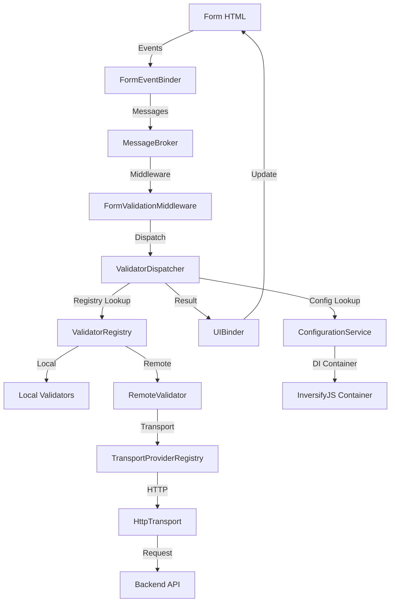

# FormValidationV1 Architecture Overview

FormValidationV1 is a comprehensive, event-driven form validation system built with TypeScript, featuring dependency injection, message brokering, and extensible validation rules.

## System Architecture

## Core Components

### Event-Driven Architecture
- **MessageBroker**: Central message routing system using publish/subscribe pattern
- **FormEventBinder**: Captures DOM events and publishes validation messages
- **FormValidationMiddleware**: Processes validation messages and manages form state

### Validation Engine
- **ValidatorDispatcher**: Routes validation requests to appropriate validators
- **ValidatorRegistry**: Manages all registered validators (local and remote)
- **Local Validators**: Synchronous validation rules (required, email, pattern, etc.)
- **RemoteValidator**: Asynchronous HTTP-based validation

### Transport Layer
- **TransportProviderRegistry**: Manages different transport providers
- **HttpTransport**: HTTP client for remote validation requests
- **ConfigurationService**: Provides global and field-specific configuration

### UI Management
- **UIBinder**: Updates form UI with validation results
- **Custom Error Messages**: Support for `data-msg-<rule>` attributes
- **Real-time Feedback**: Immediate visual feedback for validation states

## Dependency Injection

The system uses InversifyJS for dependency injection, providing:
- **Loose coupling** between components
- **Easy testing** with mock implementations
- **Runtime configuration** changes
- **Extensible architecture** for custom validators and transports

## Message Flow

1. **Event Capture**: User interacts with form field
2. **Message Publishing**: FormEventBinder publishes validation message
3. **Middleware Processing**: FormValidationMiddleware processes the message
4. **Validation Dispatch**: ValidatorDispatcher routes to appropriate validator
5. **Remote Processing**: If needed, RemoteValidator sends HTTP request
6. **Result Handling**: Validation result is processed and UI updated
7. **User Feedback**: UIBinder updates form with success/error states

## Built-in Validators

- **RequiredFieldValidator**: Ensures field is not empty
- **EmailValidator**: Validates email format
- **MinLengthValidator/MaxLengthValidator**: Length constraints
- **PatternValidator**: Regex pattern matching
- **MatchValidator**: Cross-field value matching
- **MinCheckedValidator/MaxCheckedValidator**: Checkbox group validation
- **MinSelectedValidator/MaxSelectedValidator**: Select dropdown validation
- **RemoteValidator**: HTTP-based remote validation

## Extensibility Points

- **Custom Validators**: Implement `IValidator` or `IAsyncValidator` interfaces
- **Custom Transports**: Add new transport providers for different protocols
- **Middleware**: Extend message processing with custom middleware
- **UI Customization**: Override default UI behavior and styling
- **Configuration**: Dynamic configuration updates at runtime

## License

This project is licensed under:
- **BSD 3-Clause License** for the software code
- **Creative Commons Attribution 4.0 International License** for documentation and examples

See the [LICENSE](../LICENSE) file for full details. 